# EV Charging Operations Platform

I built the backend of an EV charging platform that runs chargers in Singapore and Malaysia. A driver starts a session in the portal, the charge point executes it over OCPP 1.6J on a persistent WebSocket, and the operator console follows connector status, energy, and cost as they change. The stack is .NET, SQL Server, REST, and SignalR. My part was the real-time command path, the charging-session lifecycle, the APIs, and the prepaid payment flow that reserves balance at the start and settles it from the meter when the session stops.

This is not a source-code repository. It does not contain production code, infrastructure configuration, secrets, customer data, charger identifiers, or internal business rules.

## Role

Backend development for the operations platform, with ownership of:

- The real-time command path between the portal and charge points
- Charging-session lifecycle, from authorization through metering to settlement
- HTTP APIs used by the driver portal and the operator console
- Payment and prepaid-balance integration around a charging session

## Documents

- [Architecture](docs/architecture.md)
  - Components, trust boundaries, and how live state reaches the UI
- [OCPP command flow](docs/ocpp-flow.md)
  - Remote start and remote stop, including the sequence diagrams
- [Payment flow](docs/payment-flow.md)
  - Top-up, reservation, settlement, and refund
- [API overview](docs/api-overview.md)
  - Simplified resource model for drivers and operators

## System shape

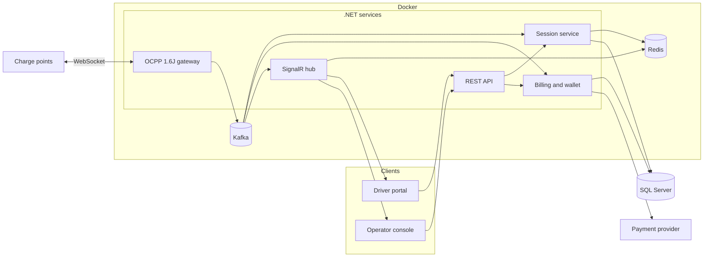

- Docker runs the .NET services as separate containers.
- Kafka carries charger and session events from the gateway to billing and the live hub.
- Redis holds the latest connector and session state so SignalR does not read SQL Server for every meter sample.

Remote start and remote stop:

- [OCPP command flow](docs/ocpp-flow.md)

## What a driver sees

The driver portal is deliberately small. A session starts only after the charger is identified, typically by scanning the code on the unit. Balance is held as tokens. Top-up sends the driver to a hosted payment page and credits the balance after the provider confirms payment.

The gallery below is the original set of product photographs, plus a live socket test. A small OCPP 1.6J simulator stood in for a home charger: it accepted remote start, reported meter values, and accepted remote stop. The session settled at 0.11 kWh against a 0.10 token hold. The simulator was disconnected after the stop, so it did not stay online.

These photographs are the originals. They show the product as it was captured, including account and site details visible on screen.

### Driver application

<table>
<tr>
<td>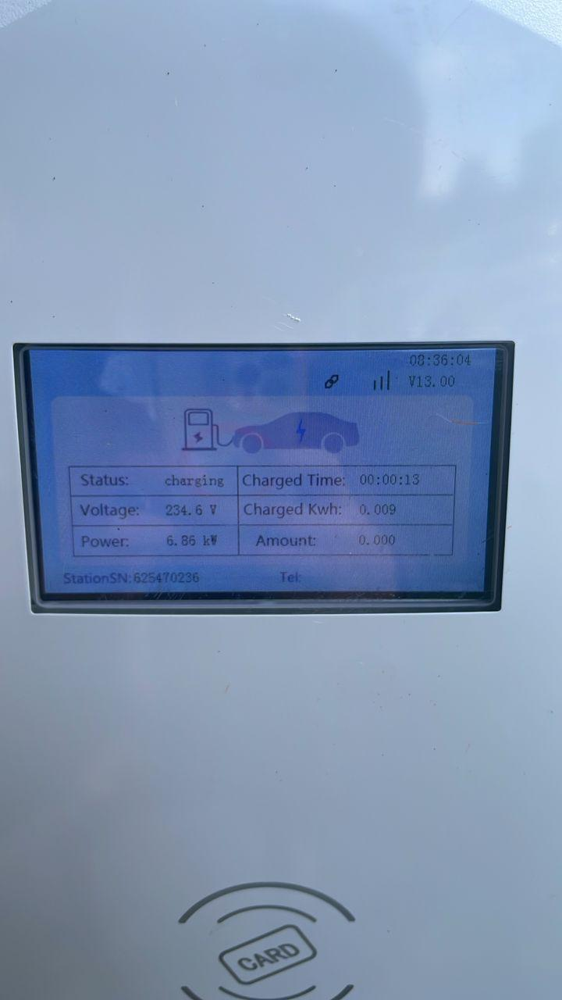</td>
<td>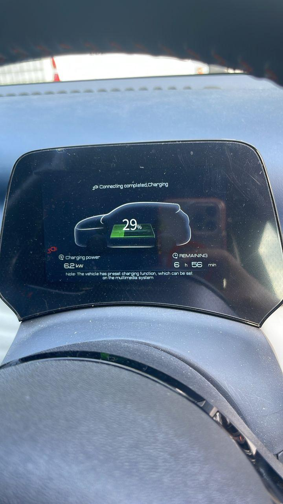</td>
<td>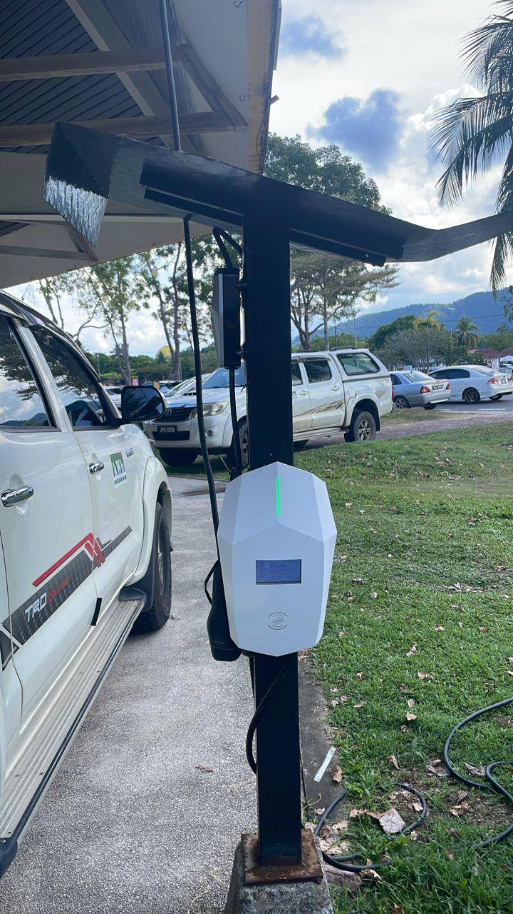</td>
</tr>
<tr>
<td>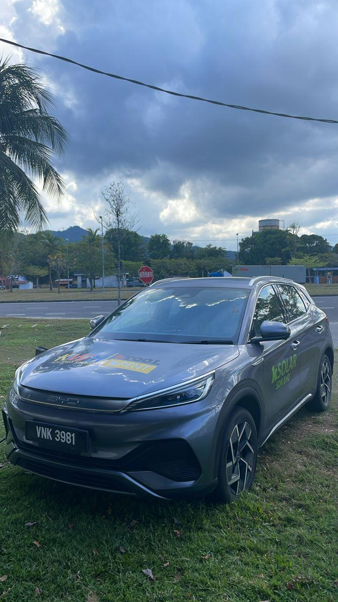</td>
<td>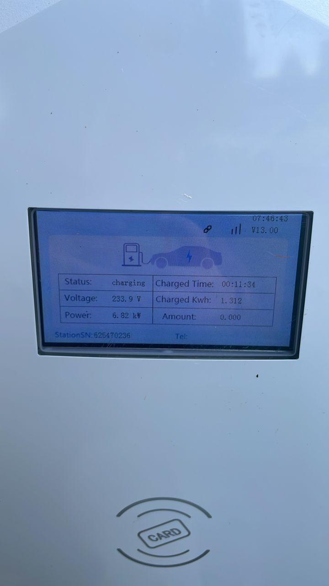</td>
</tr>
<tr>
<td>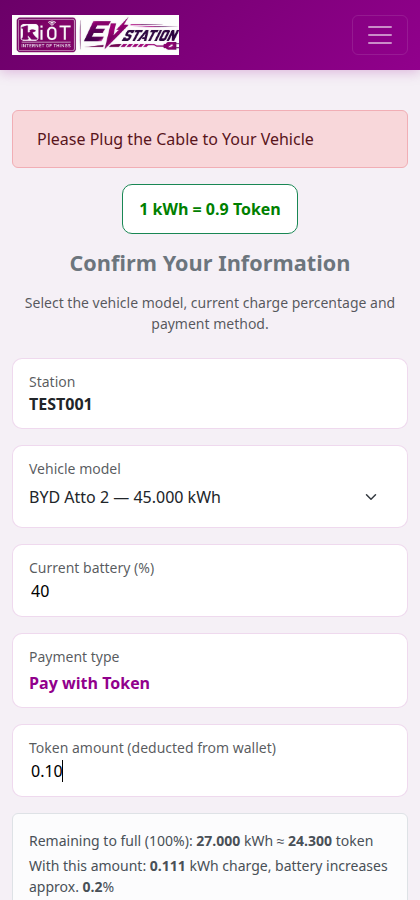</td>
<td>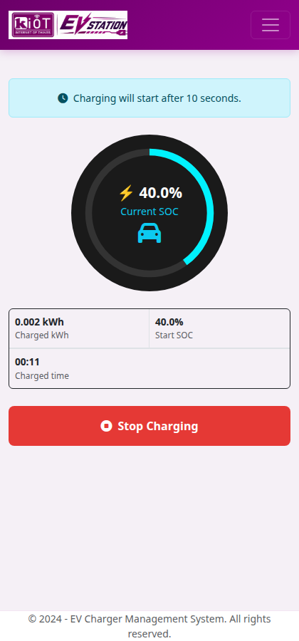</td>
</tr>
</table>

### Operator console

<table>
<tr>
<td>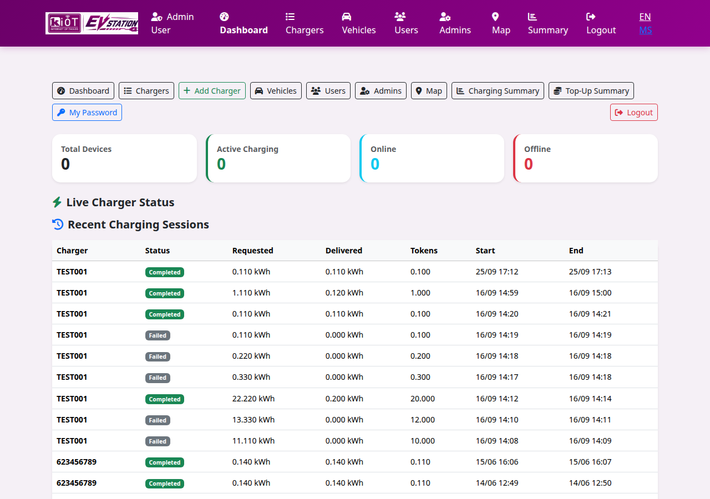</td>
<td>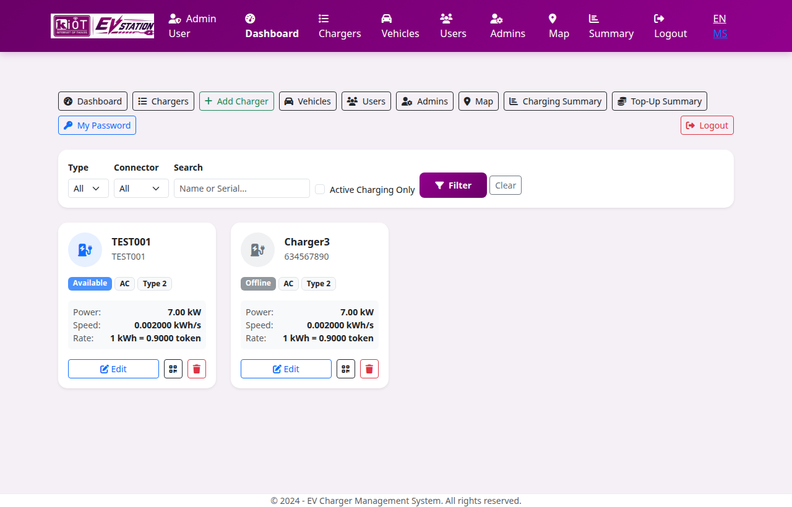</td>
</tr>
<tr>
<td colspan="2">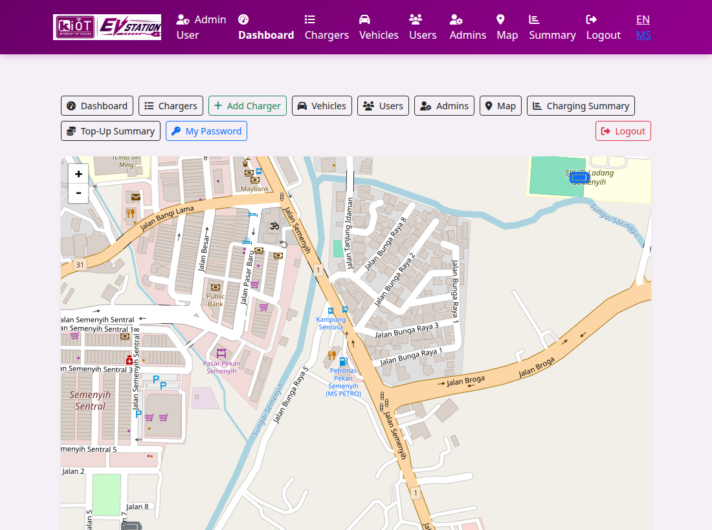</td>
</tr>
</table>

### Desktop portal

<table>
<tr>
<td>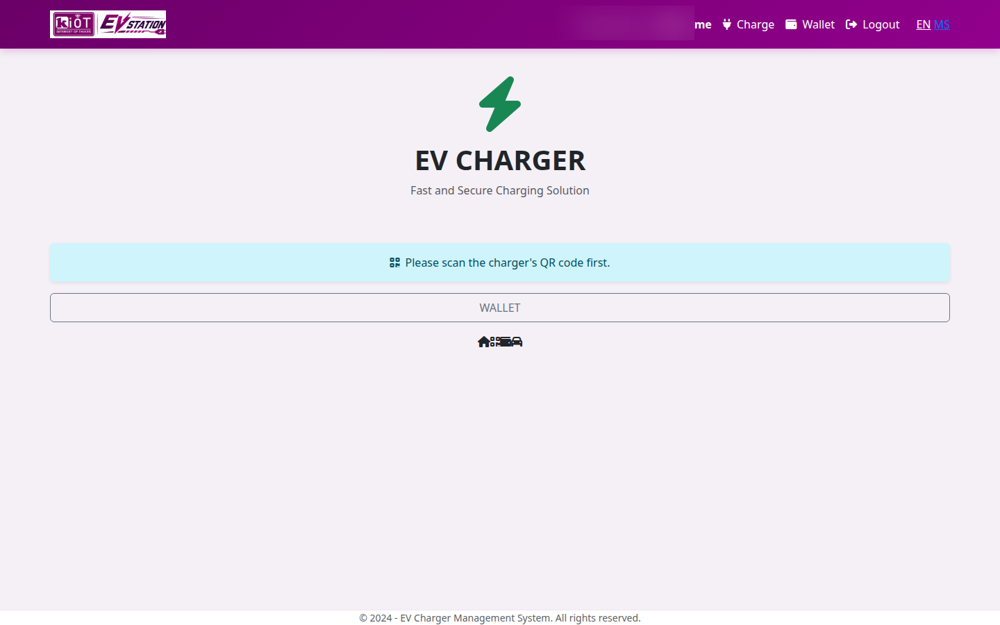</td>
<td>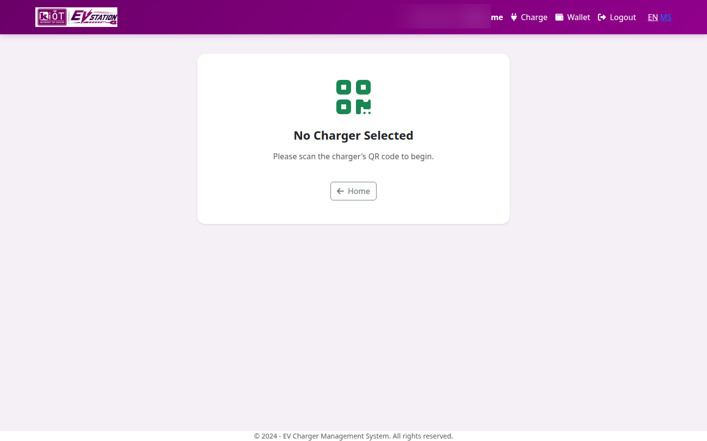</td>
<td>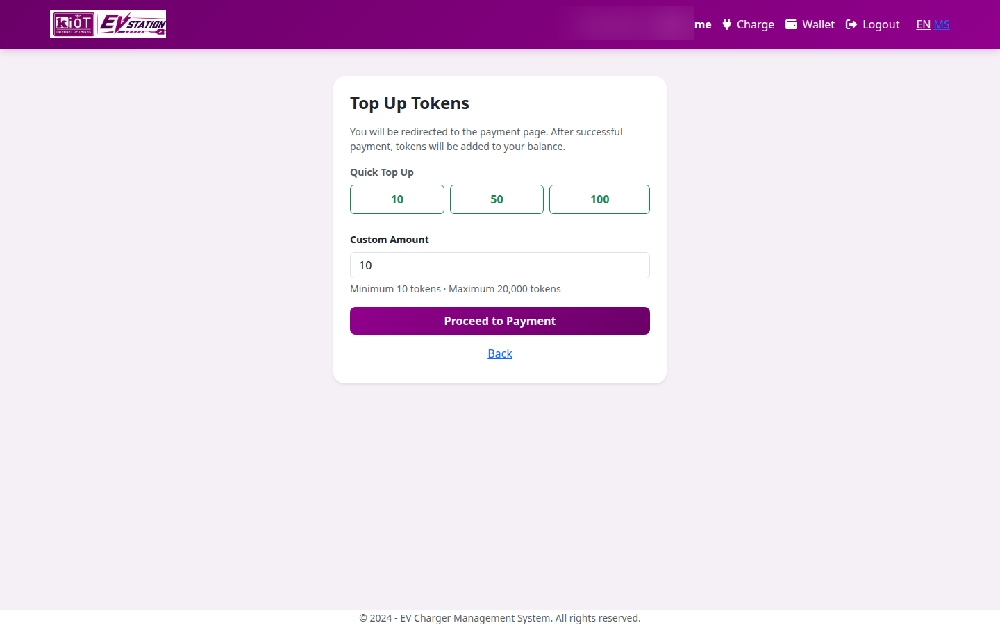</td>
</tr>
</table>

### Charger on site

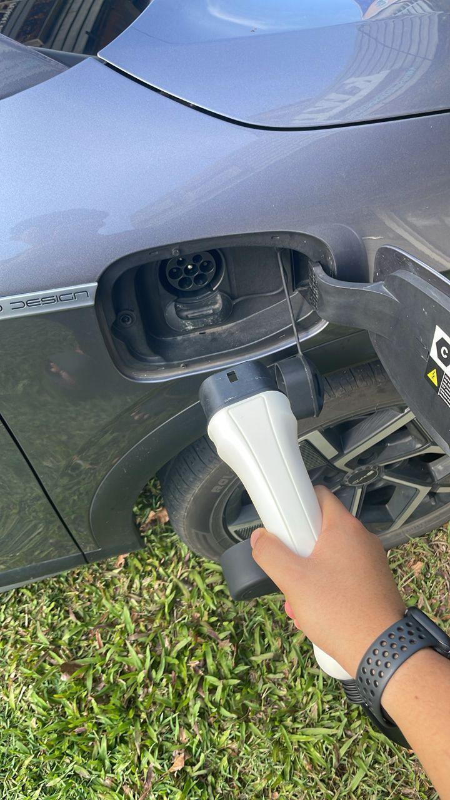

## What was hard about the backend

The interesting problems were concurrency and partial failure, not the happy-path message list.

- The charge point, not the browser, is the source of truth for energy. The API can request a start, but the session is not "charging" until the charge point confirms it.
- Meter values arrive on the WebSocket while the driver is watching a SignalR stream. Those two channels have to agree on one session record.
- A connector can accept only one active transaction. Remote start has to be rejected when the connector is offline, faulted, or already busy.
- Payment cannot wait for the final meter reading to take money, and it also cannot keep a hold forever if the charger never delivers energy. Reservation, capture, and refund are tied to OCPP outcomes.
- Many charge points stay connected at once. A dropped WebSocket has to age the charge point out of "available" without dropping in-flight session history.

## What this repository intentionally leaves out

- Application source, project files, and database scripts
- API keys, connection strings, and payment credentials
- Host names, IP addresses, and deployment topology
- Customer records, charger serial numbers, and tariff tables
- The production API contract and internal validation rules

The diagrams and API sketch in `docs/` are a teaching view of the design. They are not the production schema and not a client you can call.

## Stack

- .NET backend
- SQL Server
- OCPP 1.6J over WebSocket
- SignalR for live portal updates
- REST API for driver and operator actions
- Hosted payment page for prepaid top-up
- Multi-charge-point operations across Singapore and Malaysia
