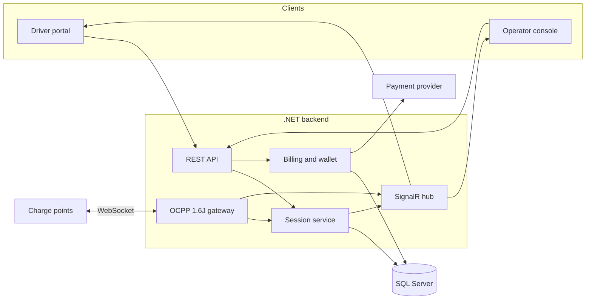
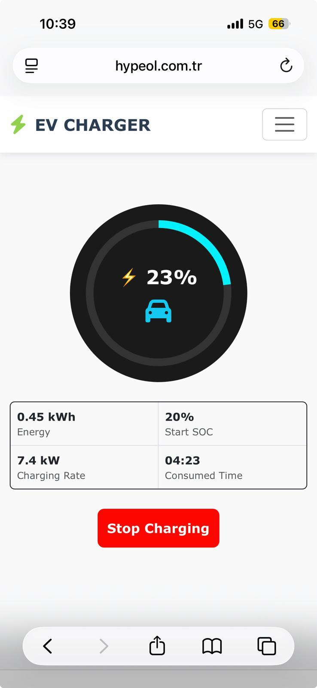

# EV Charging Operations Platform

**Portfolio case study.** This repository documents the backend of an electric-vehicle charging platform used to operate chargers in Singapore and Malaysia. It is a simplified public write-up for recruiters and backend engineering roles.

This is not a source-code repository. It does not contain production code, infrastructure configuration, secrets, customer data, charger identifiers, or internal business rules.

## Role

Backend development for the operations platform, with ownership of:

- The real-time command path between the portal and charge points
- Charging-session lifecycle, from authorization through metering to settlement
- HTTP APIs used by the driver portal and the operator console
- Payment and prepaid-balance integration around a charging session

## Platform in brief

Drivers find a charger, authorize a session, and follow energy and cost while the vehicle charges. Operators see which charge points are online, which connectors are busy, and how sessions settle.

Charge points speak **OCPP 1.6J** over a persistent **WebSocket**. The central system is a **.NET** backend with **SQL Server** as the system of record. The portals call a **REST** API. Live session state is pushed to connected browsers with **SignalR**, so the UI does not poll for meter updates. Payments are handled through a prepaid balance: the driver tops up through a hosted payment page, a session reserves balance up front, and unused balance is released when the session ends.

The same backend model supports many charge points, more than one connector per charge point, and more than one market, with tariffs and payment options that differ by country.

## Documents

| Document | What it covers |
| --- | --- |
| [Architecture](docs/architecture.md) | Components, trust boundaries, and how live state reaches the UI |
| [OCPP command flow](docs/ocpp-flow.md) | Remote start and remote stop, including the sequence diagrams |
| [Payment flow](docs/payment-flow.md) | Top-up, reservation, settlement, and refund |
| [API overview](docs/api-overview.md) | Simplified resource model for drivers and operators |

## System shape

Remote start and remote stop are specified in [docs/ocpp-flow.md](docs/ocpp-flow.md).

## What a driver sees

The driver portal is deliberately small. A session starts only after the charger is identified, typically by scanning the code on the unit. Balance is held as tokens. Top-up sends the driver to a hosted payment page and credits the balance after the provider confirms payment.

The gallery below is the original set of product photographs, plus a live socket test. A small OCPP 1.6J simulator stood in for a home charger: it accepted remote start, reported meter values, and accepted remote stop. The session settled at 0.11 kWh against a 0.10 token hold. The simulator was disconnected after the stop, so it did not stay online.

These photographs are the originals. They show the product as it was captured, including account and site details visible on screen.

Operator console, station list. One charger was online during the socket test; the other stayed offline.

Operator map, zoomed out so both chargers sit in frame. The blue pin is the charger that was online for the test. The gray pin is an offline charger. The test charger has no saved location of its own, so a temporary map pin was set for this screenshot and removed afterward.

Desktop views of the same driver portal, with the account name removed:

## What was hard about the backend

The interesting problems were concurrency and partial failure, not the happy-path message list.

- The charge point, not the browser, is the source of truth for energy. The API can request a start, but the session is not "charging" until the charge point confirms it.
- Meter values arrive on the WebSocket while the driver is watching a SignalR stream. Those two channels have to agree on one session record.
- A connector can accept only one active transaction. Remote start has to be rejected when the connector is offline, faulted, or already busy.
- Payment cannot wait for the final meter reading to take money, and it also cannot keep a hold forever if the charger never delivers energy. Reservation, capture, and refund are tied to OCPP outcomes.
- Many charge points stay connected at once. A dropped WebSocket has to age the charge point out of "available" without dropping in-flight session history.

## What this repository intentionally leaves out

- Application source, project files, and database scripts
- API keys, connection strings, and payment credentials
- Host names, IP addresses, and deployment topology
- Customer records, charger serial numbers, and tariff tables
- The production API contract and internal validation rules

The diagrams and API sketch in `docs/` are a teaching view of the design. They are not the production schema and not a client you can call.

## Stack

- .NET backend
- SQL Server
- OCPP 1.6J over WebSocket
- SignalR for live portal updates
- REST API for driver and operator actions
- Hosted payment page for prepaid top-up
- Multi-charge-point operations across Singapore and Malaysia
