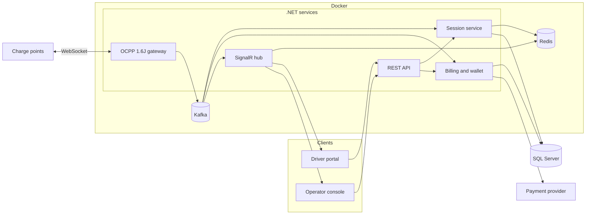

# Architecture

Simplified view of the EV charging operations platform. Component names below describe responsibilities. They are not production service names, database tables, or host names.

## Responsibilities

| Part | Responsibility |
| --- | --- |
| Driver portal | Identify a charger, start and stop a session, show live energy and cost, top up balance |
| Operator console | Fleet status, connectors, sessions, tariffs, invoices, and exception handling |
| REST API | Synchronous commands and queries for both portals. Authorizes the caller and validates that the connector can accept the command |
| Session service | Owns the charging-session lifecycle and the link between a portal user, a connector, and an OCPP transaction |
| OCPP gateway | Terminates charge-point WebSockets, speaks OCPP 1.6J, and translates protocol messages into session events |
| Billing and wallet | Prepaid balance, top-up confirmation, reservation at start, settlement at stop, refund when energy was not delivered |
| SignalR hub | Pushes connector status and in-progress meter readings to browsers that are allowed to see that session |
| SQL Server | System of record for users, charge points, sessions, meter snapshots, and ledger entries |
| Kafka | Event log between the gateway and the rest of the backend. Meter samples, start, and stop are published once and consumed by session, billing, and the live hub |
| Redis | Hot store for the latest connector status and in-progress session view. Also the backplane when more than one SignalR instance is running |
| Docker | Packages each .NET service so the gateway, API, session, billing, and hub can be deployed and scaled on their own |
| Payment provider | Hosted payment page. The backend never handles raw card data |
| Charge point | AC or DC charger. Opens the WebSocket outbound. Executes start and stop locally and reports meter values |

## Diagram

## Trust boundaries

Three boundaries matter.

1. **Browser to API.** The driver and the operator authenticate to the REST API. A driver can act only on their own sessions and balance. An operator can act on the charge points in their scope. The browser never talks OCPP.

2. **Charge point to gateway.** Each charger keeps a WebSocket open to the gateway and is authenticated as a known charge point. Status, meter values, and transaction messages arrive on that socket. Commands such as remote start and remote stop are sent back down the same socket. If the socket drops, the charge point is treated as offline even if the last stored status was "available".

3. **Backend to payment provider.** Top-up redirects the driver to a hosted page. The provider notifies the backend of success or failure. Card numbers and payment credentials stay with the provider.

## Why the session service sits in the middle

OCPP transactions and portal sessions are not the same object. A portal session is what the driver requested. An OCPP transaction is what the charger confirmed, with a start meter and a stop meter. The session service is the only place that binds those together. The API does not write meter values, and the gateway does not decide tariffs.

That split keeps protocol code replaceable. OCPP 1.6J is the protocol in production. Session, billing, and API rules do not need to change shape if a later charger speaks a newer protocol, as long as the gateway still emits the same session events: online, available, start accepted, meter, stop, offline, fault.

## Live updates

Two real-time paths run at once during a session.

- The charger streams meter values over its WebSocket.
- The gateway publishes the sample on Kafka. Session, billing, and the hub consume that stream instead of calling each other directly.
- Redis keeps the latest sample. SignalR reads it and pushes energy so far, instantaneous power, elapsed time, and estimated cost.
- The driver portal and the operator console subscribe only to sessions they are allowed to see.

The REST API remains the source for anything that must be durable: the session record, the final cost, and the ledger entry. SignalR is a cache of the latest sample, not the ledger.

## Scale considerations

The design assumes many quiet sockets and a smaller number of active sessions.

- One long-lived WebSocket per charge point. Heartbeats keep the connection honest. A missed heartbeat marks the charger offline and blocks new remote starts.
- Session writes are keyed by connector. Two remote starts for the same connector cannot both win.
- Meter samples are appended. The UI receives the latest sample. Billing uses the start and stop meter readings, not every intermediate sample, so a burst of meter values cannot double-charge.
- Operator views read current status from the session store. They do not query each charger.
- Markets are a dimension on tariff and payment configuration. Singapore and Malaysia share the session pipeline. They do not share a tariff table.

## Failure modes the design expects

| Event | Expected behavior |
| --- | --- |
| Charger rejects remote start | Session stays unstarted. Reserved balance is released. The driver sees a failed start. |
| Charger accepts start but never sends a start transaction | Session expires out of "starting". Reserved balance is released. |
| Socket drops mid-session | Session stays open until a stop transaction arrives or an operator closes it from the last known meter. The connector is not offered as available. |
| Charger stops with the same meter it started with | Treated as no energy delivered. Reserved balance is refunded. |
| Payment provider never confirms the top-up | Balance does not change. The driver can retry. |
| Duplicate provider notification | Ledger credit is idempotent. A second notice does not add balance twice. |
