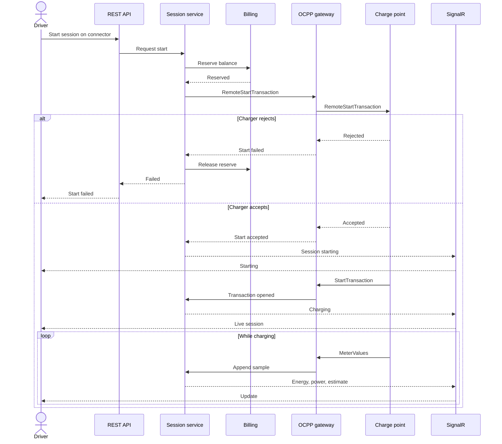
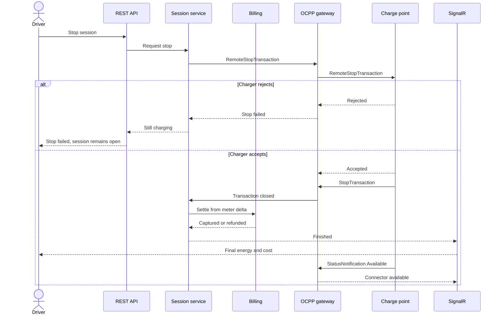

# OCPP command flow

Charge points connect with **OCPP 1.6J** over **WebSocket**. The charger opens the socket. The central system sends commands on that socket and receives status, authorization, and meter messages.

This document is the simplified command flow for remote start and remote stop. It is not a trace from production, and it does not list internal topics, identifiers, or validation rules.

## Connection lifecycle

After the socket is up, a healthy charger is expected to:

1. Announce itself (`BootNotification`) so the gateway can accept the connection and align clock and heartbeat interval.
2. Report each connector (`StatusNotification`): available, preparing, charging, suspended, finishing, or faulted.
3. Send heartbeats on the agreed interval.
4. Accept or reject central commands, then follow with the transaction messages that actually move energy.

RFID authorization uses `Authorize` when a driver presents a tag at the charger. The portal path does not depend on a tag. It uses remote start, described below. Both paths end in the same transaction record.

## Remote start

The driver has already identified the charger and chosen a connector. The API checks three things before any OCPP call: the caller may use this connector, the connector is online and available, and the wallet can reserve the session amount.

Important ordering:

- **Accepted is not the same as charging.** `RemoteStartTransaction` accepted means the charger will try. The session becomes charging only when `StartTransaction` arrives with a meter start.
- **The reserve happens before the OCPP call.** If the charger is unreachable, the driver is not left in a half-authorized state, and the reserve is released.
- **One active transaction per connector.** A second start is rejected in the session service even if a stale UI still shows the connector as free.

## Remote stop

The driver, or an operator, asks for stop. The charger confirms with `StopTransaction`, which carries the closing meter reading. Settlement uses that reading.

Settlement rules at this level of detail:

- Energy is the difference between the stop meter and the start meter.
- Cost is energy priced with the tariff that was in force when the session started.
- If the delta is zero, or the charger reports that it never delivered power, the reserved balance is returned.
- If the delta is below the reserved amount, the unused portion is released and the used portion is captured.
- The ledger write and the session close commit together. A retry of the same stop transaction does not charge twice.

## Status the operator console cares about

The console does not send OCPP itself. It reads the projection the gateway and session service maintain.

| Projection | Driven by |
| --- | --- |
| Charge point online or offline | Socket open, plus heartbeat |
| Connector available, charging, or faulted | `StatusNotification` |
| Active session and transaction | `StartTransaction` until `StopTransaction` |
| Energy and power | `MeterValues` |
| Final cost | Stop meter plus tariff, written by billing |

A connector that still has an open transaction is never shown as available, even if a status message arrives out of order. The session record wins until it is closed.

## What this flow does not specify

Message field layouts, registration credentials, serial numbers, tariff math, and the exact error catalog are production details and are intentionally omitted.
