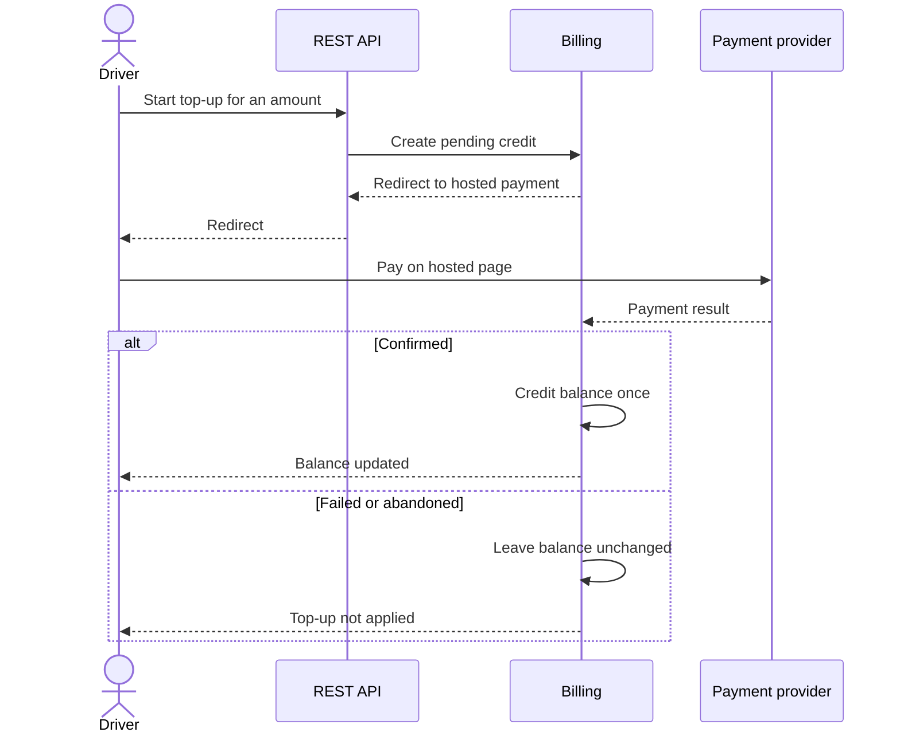
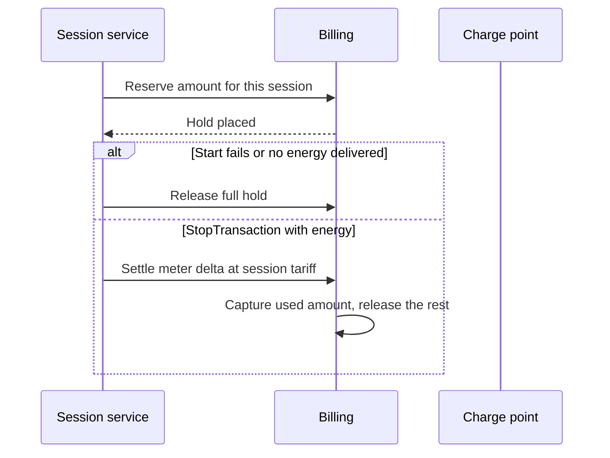

# Payment flow

Charging is prepaid. The driver holds a token balance, tops it up through a hosted payment page, and spends it on sessions. The backend records the ledger. The payment provider handles the payment instrument.

This is a simplified flow. It does not name the provider, list credentials, or describe production pricing.

## Why prepaid

A session's final cost is unknown at start, because energy depends on the vehicle, the charger, and how long the driver stays. Taking the full unknown amount later is a poor fit for a charger that may go offline. Reserving a bounded amount up front, then settling against the meter, keeps the driver's balance and the session outcome in the same transaction boundary.

## Top-up

Properties that matter:

- The portal offers fixed amounts and a custom amount within a minimum and a maximum. The bounds are product rules, not shown here as a pricing table.
- The driver leaves the portal for the hosted page and returns after the provider finishes.
- A repeated success notification for the same top-up credits the balance once.
- Raw card data is not stored by the charging backend.

Markets in Singapore and Malaysia do not have to offer the same instruments. Online banking, cards, e-wallets, and QR payment are all in the product's range. Which instrument is offered is a market setting. The session pipeline does not branch on the instrument. It only sees that a top-up was confirmed.

## Session reserve and settlement

The hold is created only after the API has accepted the start request, and it is released if the charger rejects the command or never opens a transaction. See [OCPP command flow](ocpp-flow.md) for how those protocol outcomes map onto the session.

## Ledger

Every balance change is a ledger entry with a type, not an overwrite of a single number. The types used by this flow are:

| Type | When it is written |
| --- | --- |
| Top-up | Payment provider confirms a credit |
| Reserve | A session is allowed to start |
| Capture | A finished session had a non-zero energy cost |
| Release or refund | Unused reserve, a failed start, or a session that delivered no energy |

The balance shown in the portal is the sum of posted entries. An in-progress session shows the reserve so the driver can see what is still available for other sessions.

## Operator side

Operators do not take card payments in the console. They see session cost, invoices, and exceptions: a session that closed without a meter stop, a refund that was issued because the charger delivered no power, or a top-up that stayed pending. Corrections are further ledger entries. They do not edit a closed session's meter readings in place.

## Out of scope for this write-up

Provider endpoints, merchant identifiers, webhook signatures, tariff rows, tax treatment, and the exact rounding rule are omitted on purpose.
